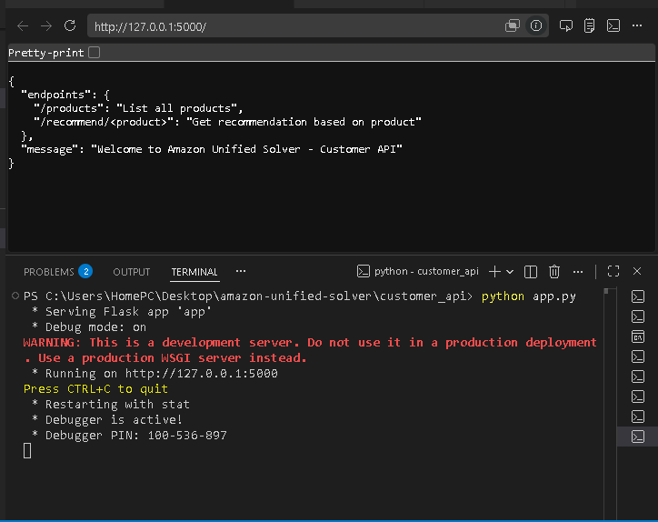
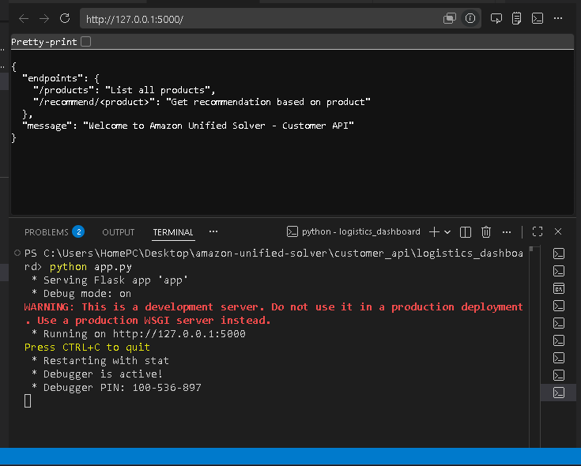
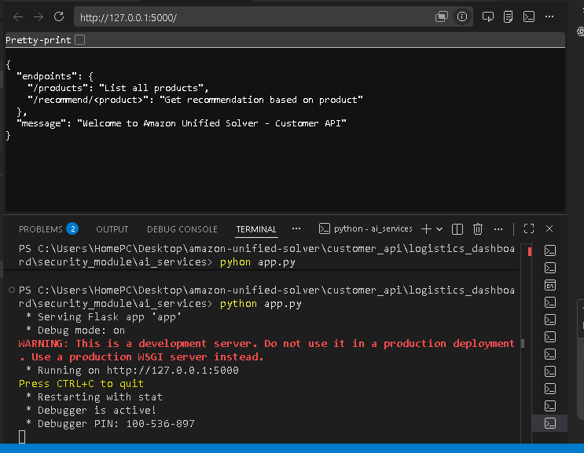

# Amazon Unified Solver 🚀

A multi-module backend project solving Amazon challenges:
- Customer API (recommendations)
- Logistics Dashboard (supply chain simulation)
- Security Module (scam detector)
- AI Services (text summarizer)
- Training Game (cybersecurity awareness quiz)

---

## Customer API


How to Run:
1. cd customer_api
2. python app.py
3. Open browser:
   - http://127.0.0.1:5000/
   - http://127.0.0.1:5000/products
   - http://127.0.0.1:5000/recommend/laptop

---

## Logistics Dashboard


How to Run:
1. cd logistics_dashboard
2. python app.py
3. Open browser:
   - http://127.0.0.1:5000/
   - http://127.0.0.1:5000/shipments
   - http://127.0.0.1:5000/shipment/1

---

## Security Module


How to Run:
1. cd security_module
2. python app.py
3. POST request to /check with JSON:
   ```json
   {"message": "You won a lottery prize"}
